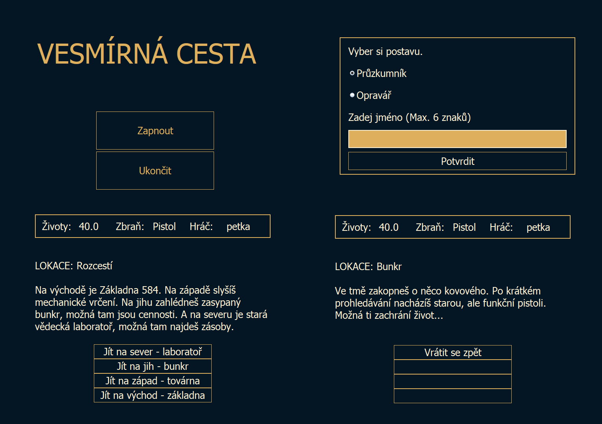

  <a href="#popis-projektu">popis projektu</a> •
  <a href="#popis-práce">popis práce</a> •
  <a href="#ovládání-programu">ovládání programu</a> •
  <a href="#poznámky">poznámky</a>

# popis projektu
- Textová sci-fi RPG hra napsaná v Javě
- Obsahuje prvky OOP a GUI v Java Swing
- Jednoduchý příběh
- Souboje s nepřáteli založené na tahovém systému

# popis práce

- ### co jsem se naučila nového?
    - Dědičnost a přepisování metod v Javě
    - Základy Swing GUI
    - Strukturování kódu do tříd
    - Tvorbu jednoduché herní logiky a stavů hry

- ### co bylo nejtěžší?
    - Propojení GUI s herní logikou
    - Pochopení konstruktorů a dědičnosti
    - Java..

- ### zhodnocení
    - Hra funguje podle očekávání
    - Naučila jsem se hodně o programování a tvorbě interaktivních programů
    - Kód je jednoduchý, ale splňuje svůj účel

# ovládání programu
- Na začátku si vyberete postavu a zadáte jméno
- Začne příběh a můžete se vydat do různých lokací
- Probíhá tahový boj s nepřítelem
- Po získání kartičky lze hru dokončit

# ukázka hry

# poznámky
- Projekt je školní práce
- Neobsahuje inventář ani pokročilé mechanismy
- Kód je jednoduše rozšiřitelný
